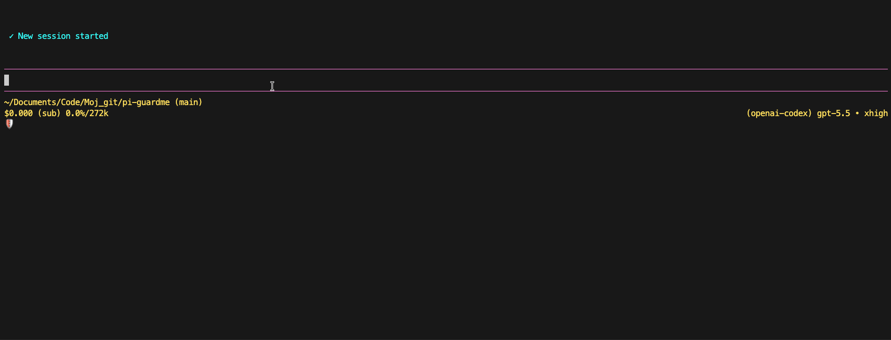

<p align="center">
  
</p>

<p align="center">
  <a href="https://pi.dev"></a>
  <a href="https://www.npmjs.com/package/@senad-d/guardme"></a>
  <a href="LICENSE"></a>
  <a align="center" href="https://sonarcloud.io/summary/new_code?id=senad-d_GuardMe"></a>
</p>

<p align="center">
  IAM-like guardrails for <a href="https://pi.dev">pi</a>.
  <br />Protect shell and filesystem tool access with deny-first policy.
</p>

---

GuardMe is a Pi extension for LLM tool-call safety. It checks Pi shell and filesystem tool calls before execution, merges global and project YAML policy, blocks hard-denied actions, and asks for approval when risky or policy-missing actions repeat.

<table align="center">
  <tr>
    <th>GuardMe demo</th>
  </tr>
  <tr>
    <td align="center">
      
    </td>
  </tr>
</table>

- **Deny-first:** deny rules and hard protections always win over allow rules.
- **Shell-aware:** compound commands are evaluated by executable segment, including common wrappers and package-manager scripts.
- **Filesystem-aware:** sensitive paths, `.git`, credentials, destructive moves/deletes, and unsafe generated file content are guarded.
- **Approval-based:** first risky attempts are blocked with coaching; repeated attempts can use an in-session approval flow.
- **Pi-native:** install globally, project-locally, from git, or from a source checkout.
- **Configurable:** use `/guardme`, `~/.pi/agent/guardme.yaml`, and `.pi/agent/guardme.yaml`.

> **Security:** pi packages run with your full system permissions. GuardMe reduces accidental or model-requested access inside Pi sessions, but it is not an OS sandbox or privilege boundary. It can read/write GuardMe policy, settings, and state files under `~/.pi/agent/` and `.pi/agent/`. Read [`SECURITY.md`](SECURITY.md).

## Table of Contents

- [Quick Start](#quick-start)
- [Installation](#installation)
- [How GuardMe Works](#how-guardme-works)
- [Policy and State Files](#policy-and-state-files)
- [Configuration](#configuration)
- [Commands](#commands)
- [Approval Flow](#approval-flow)
- [Troubleshooting](#troubleshooting)
- [Diagnostics](#diagnostics)
- [Update and Uninstall](#update-and-uninstall)
- [Development](#development)
- [Publishing](#publishing)
- [License](#license)

---

## Quick Start

```bash
pi install npm:@senad-d/guardme
```

Start pi and open GuardMe:

```bash
pi
```

```text
/guardme
```

Use the General pane to review status, the Insecure edits escape hatch, project trust, warnings, diagnostics, and setup actions. GuardMe is active by default when no project-local runtime setting disables it.

Try it in a Pi session:

1. Ask Pi to run a normal project command such as `pwd && ls -lh`.
2. Ask Pi to run an unknown or risky command.
3. GuardMe blocks the first matching risky attempt and adds model-facing safety guidance.
4. Repeat the same action to trigger the approval flow when UI is available.

If the npm package is unavailable before a public release, use the source-checkout workflow below.

---

## Installation

| Scope | Command | Notes |
| --- | --- | --- |
| Global | `pi install npm:@senad-d/guardme` | Loads in every trusted pi project. |
| Project-local | `pi install npm:@senad-d/guardme -l` | Writes to `.pi/settings.json` in the current project. |
| One run | `pi -e npm:@senad-d/guardme` | Try without changing settings. |
| Git | `pi install git:github.com/senad-d/GuardMe@<tag>` | Pin a tag or commit. |
| Local checkout | `pi --no-extensions -e .` | Develop or test this repository in isolation. |

Source checkout:

```bash
git clone https://github.com/senad-d/GuardMe.git guardme
cd guardme
npm install
npm run validate
pi --no-extensions -e .
```

Use the checkout globally while developing:

```bash
pi install /absolute/path/to/guardme
```

GuardMe has no npm install-time setup step. Missing policy files are valid: the extension applies built-in defaults at runtime. To create an editable starter policy, run `/guardme` and choose a global or project policy from Setup.

---

## How GuardMe Works

GuardMe checks Pi LLM tool calls before they run:

- shell commands through `bash`
- file reads through `read`
- file discovery/listing through `grep`, `find`, and `ls`
- file writes/edits through `write` and `edit`
- generated shell-like content before mutation
- local script execution such as `./script.sh` or `bash script.sh`
- package-manager scripts such as `npm test`, `npm run test`, `pnpm run build`, `yarn test`, and `bun run test`
- deletes, renames, and moves detected from shell commands

Policy is deny-first, similar to AWS IAM: hard protections and deny rules always win. Shell commands are segment-aware and default-deny, so every executable segment in a `bash` command must match `allowCommands` or go through the warned-once approval path.

Examples:

- `pwd && ls -lh` can run when both `pwd *` and `ls *` are allowed.
- `pwd && unknown-tool` is blocked as policy-missing.
- `cat .env`, `cat /etc/passwd`, and `find . -delete` are blocked unless policy and approval rules permit the action.
- Cloud CLIs such as `aws`, `az`, and `gcloud` are hard-denied, including common wrapper and package-runner forms.

See [`docs/POLICY.md`](docs/POLICY.md) for the full policy reference.

---

## Policy and State Files

| Scope | Policy YAML | Generated state | Runtime settings |
| --- | --- | --- | --- |
| Global | `~/.pi/agent/guardme.yaml` | `~/.pi/agent/guardme-state.jsonl` | n/a |
| Project local | `.pi/agent/guardme.yaml` | `.pi/agent/guardme-state.jsonl` | `.pi/agent/guardme-settings.json` |

Global policy loads first. Project-local policy, runtime settings, and generated state load only after the project is trusted. Missing runtime settings mean GuardMe is active and Insecure edits is off. Turning GuardMe off from `/guardme` writes project-local settings and bypasses GuardMe enforcement for that trusted project until you turn it active again. Turning Insecure edits on writes the same project-local settings file and makes only `write`/`edit` skip proposed content/script scanning; path protections and deny rules still apply, and `bash`, reads, and discovery tools stay guarded.

YAML sections:

- `allowPaths`
- `denyPaths`
- `zeroAccessPaths`
- `readOnlyPaths`
- `noDeletePaths`
- `allowCommands`
- `denyCommands`
- `dangerousCommands`
- `protectedCredentialPaths`

GuardMe refuses unsafe policy/state paths such as symlinks, oversized files, or policy writes that would capture secret-like command values. New policy writes use owner-only file permissions.

---

## Configuration

The usual setup path is to run:

```text
/guardme
```

Use the in-session TUI to:

- turn GuardMe `active` or `off` for the current project
- turn **Insecure edits** on/off when you need `write`/`edit` to author scripts that contain otherwise blocked commands
- review or enable Pi project trust
- inspect warnings and diagnostics
- create starter global or project policy files
- save approval decisions as project or global rules

Minimal policy example:

```yaml
version: 1

allowCommands:
  - pattern: "pwd *"
    reason: "Working-directory discovery"
  - pattern: "ls *"
    reason: "Project file listing after path protections pass"
  - pattern: "npm run validate*"
    reason: "Project validation"

denyCommands:
  - pattern: "sudo *"
    reason: "Privilege escalation is blocked"
  - pattern: "sudoedit *"
    reason: "Privilege escalation is blocked"

dangerousCommands:
  - pattern: "rm -rf *"
    reason: "Recursive deletion requires approval"

zeroAccessPaths:
  - pattern: "~/.ssh/**"
    reason: "SSH material is unavailable"

readOnlyPaths:
  - pattern: "docs/**"
    reason: "Documentation is read-only"
```

Common built-in protections include cloud CLIs, privilege escalation, disk formatting/raw disk operations, `.git` deletion, credential-like files, `.env`, SSH keys, broad credential discovery, unsafe generated script content, and destructive commands aimed at protected descendants. **Insecure edits** deliberately skips proposed content/script scanning only for `write` and `edit`; use it temporarily and remember that protected paths such as `.env` remain blocked.

---

## Commands

| Command | Description |
| --- | --- |
| `/guardme` | Open the GuardMe configuration TUI on the General pane. |
| `/guardme help` | Show compact command usage. |

The General pane includes project active/off state, Pi project-trust controls, warning detail screens, diagnostic detail screens, policy setup, and rule views.

---

## Approval Flow

For dangerous-but-not-hard-forbidden actions and policy-missing shell/script commands:

1. First matching attempt: GuardMe blocks the tool call, records a warned fingerprint, and gives the model safer-behavior guidance.
2. Repeated matching attempt: GuardMe asks the user in an in-session approval prompt when UI is available.
3. No UI available: GuardMe fails closed and blocks the action.

Approval choices:

- Allow once
- Deny once
- Allow + save project rule
- Deny + save project rule
- Allow + save global rule
- Deny + save global rule

Saved decisions append narrow YAML rules, reload policy for the current session, and record redacted state. GuardMe refuses to save allow rules for hard-denied actions and refuses persistent command rules that contain secret-like values.

---

## Troubleshooting

| Problem | Try |
| --- | --- |
| Expected command is blocked | Open `/guardme`, inspect the warning, then allow once or save a narrow project/global rule if appropriate. |
| Approval prompt does not appear | Approval requires an interactive UI. Non-UI sessions fail closed by design. |
| Project policy or settings are ignored | Trust the project from `/guardme` and reload/restart pi if needed. |
| Cloud CLI is blocked | This is a hard protection. Run cloud commands outside Pi or use a separate, intentionally isolated workflow. |
| A broad command allow still blocks | GuardMe evaluates every executable segment and protected path first; allow `ls *` cannot approve `ls && rm -rf build` or `cat .env`. |
| Saved rule is refused | GuardMe will not persist hard-denied actions or command rules containing secret-like values. Use allow once or add a sanitized rule manually. |
| Need a starter policy file | Run `/guardme`, open Setup, and create global or project defaults. Missing files are okay because built-in defaults still apply. |

---

## Diagnostics

Use `/guardme` to open warning and diagnostic detail screens. Diagnostics include policy load problems, unsafe symlink or size checks, skipped project-local resources, malformed YAML/state, refused policy writes, and other fail-closed conditions.

Validation from a source checkout:

```bash
npm run validate
```

Useful focused checks:

```bash
npm run typecheck
npm run test
npm run check:pack
```

See [`docs/VALIDATION.md`](docs/VALIDATION.md) for isolated and manual smoke scenarios.

---

## Update and Uninstall

```bash
pi update --extensions                  # update installed pi packages
pi update npm:@senad-d/guardme          # update GuardMe only
pi remove npm:@senad-d/guardme          # remove global install
pi remove npm:@senad-d/guardme -l       # remove project-local install
```

Removing the package does not automatically delete policy or state files under `~/.pi/agent/` or `.pi/agent/`. Review those files before deleting them manually.

---

## Development

```bash
npm ci
npm run typecheck
npm run test
npm run check:pack
npm run validate
```

Run GuardMe from this checkout in an isolated Pi session:

```bash
pi --no-extensions -e .
```

Additional checks:

```bash
npm run format:check
npm run test:e2e
```

Implementation references:

- [`docs/PROJECT_DEFINITION_BRIEF.md`](docs/PROJECT_DEFINITION_BRIEF.md)
- [`docs/POLICY.md`](docs/POLICY.md)
- [`docs/VALIDATION.md`](docs/VALIDATION.md)
- [`specs/spec-architecture.md`](specs/spec-architecture.md)
- [`specs/spec-guidelines.md`](specs/spec-guidelines.md)
- [`specs/spec-tasks.md`](specs/spec-tasks.md)

---

## Publishing

GuardMe publishes to npm as `@senad-d/guardme`. You need an npm account with publish access to the `@senad-d` scope.

```bash
npm login
npm whoami
node scripts/publish-npm.mjs
```

The publish script requires a clean working tree, asks for the version number, runs validation, updates `package.json` and `package-lock.json` with `npm version <version>`, creates the `v<version>` git tag, publishes with `npm publish --access public`, and then offers to push the release commit and tag.

Run it only from a clean working tree after updating `CHANGELOG.md`.

## License

MIT
